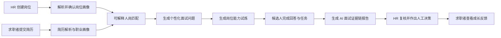
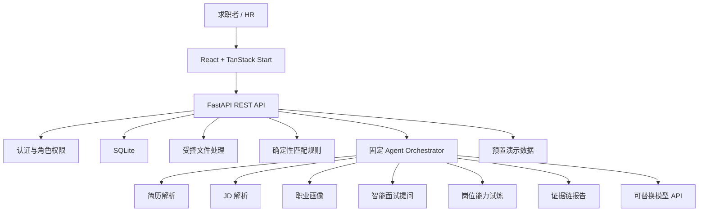

# HireLink

> 真人面试前的 AI 招聘能力验证与辅助决策平台。

HireLink 面向大学生求职者与企业招聘人员，将简历解析、岗位理解、人岗匹配、个性化面试、岗位能力试炼和证据链报告连接为完整流程。系统通过规则程序、AI 和人工确认协作，提高招聘初筛的信息质量，同时为求职者提供可理解、可执行的成长反馈。

HireLink 不替代 HR 作出录用或淘汰决定。岗位画像、面试内容、报告发布和招聘决策等关键环节均保留人工确认，重要结论尽量关联原始证据。

## 核心问题与产品价值

传统招聘流程中，简历、岗位要求、面试回答和评价报告通常彼此割裂：

- 求职者难以理解自己与目标岗位的具体差距，也缺少针对真实岗位的练习与反馈。
- HR 需要处理大量结构不同的简历，单纯依赖关键词或主观经验，筛选成本高且依据难以复核。
- 通用面试与统一题库难以验证候选人能否完成具体岗位任务。
- 单一分数或 AI 结论缺少来源说明，难以支持可靠的人工决策。

HireLink 以岗位能力验证为主线，让岗位画像成为统一参照，并将候选人的经历、回答与任务交付组织为连续证据。企业获得可复核的招聘辅助材料，求职者获得岗位匹配解释、能力短板和行动建议。

## 核心功能

### 岗位能力试炼

根据岗位画像、候选人经历和匹配缺口生成轻量岗位任务，明确业务背景、任务要求、交付物与评分标准。候选人可提交文本、链接或限定类型附件，任务结果与评价证据进入最终报告。

### AI 面试证据链报告

将职业画像、人岗匹配、候选人回答和岗位任务表现汇总为结构化报告。重要评分、风险和建议关联相应证据，同一报告按权限提供 HR 视图与求职者视图，减少双端口径差异。

### 可解释人岗匹配

从技能匹配、经历匹配、项目相关度和求职意向等维度计算匹配结果。规则程序负责稳定评分，AI 负责解释推荐理由、能力缺口和待验证事项，最终判断仍由 HR 作出。

### 固定多 Agent 协作

将简历解析、职业画像、JD 解析、人岗匹配、智能提问、岗位任务和报告生成拆分为职责清晰的节点，由固定 Orchestrator 按业务顺序调度。协作面板用于展示节点状态、脱敏摘要、模型与 Prompt 版本、耗时和错误信息。

### 个性化面试与会话记录

根据岗位要求、简历经历和匹配缺口生成个性化问题。候选人可逐题回答，通过浏览器语音转写或文字输入形成可确认的文字稿，并支持会话进度保存与恢复。

### 双端工作台

- **求职者端**：简历解析、职业画像、岗位匹配、面试与试炼、成长反馈。
- **HR 端**：岗位画像确认、候选人排序、面试与任务配置、证据报告复核、人工决策。

## 产品使用流程



1. HR 创建岗位并提交 JD，确认系统整理的岗位职责、技能与任职要求。
2. 求职者提交简历，系统形成结构化简历与职业画像。
3. 系统计算人岗匹配结果，说明匹配理由、能力缺口和待验证事项。
4. 系统生成个性化面试问题与岗位能力试炼，由 HR 确认后进入候选人流程。
5. 候选人逐题回答并确认文字稿，同时提交岗位任务结果。
6. 系统汇总画像、匹配、回答和任务证据，生成结构化报告。
7. HR 复核报告并决定是否进入真人面试。
8. 报告确认后，求职者查看个人可见的能力反馈和行动建议。


## 技术架构

HireLink 采用前后端解耦的模块化单体架构。前端负责双端产品交互，FastAPI 后端负责业务状态、权限、文件处理、确定性规则和 AI 工作流编排。



### 技术栈

| 层级 | 技术 |
|---|---|
| 前端 | React 19、TanStack Start、TanStack Router、TanStack Query |
| UI | Tailwind CSS 4、Radix UI、Lucide React、Recharts |
| 构建与依赖 | Vite 7、TypeScript 5、Bun |
| 后端 | Python 3.12、FastAPI、Uvicorn、Pydantic |
| 数据与迁移 | SQLite、SQLAlchemy、Alembic |
| 安全基础 | JWT、HttpOnly Cookie、Argon2id |
| 文件解析 | pypdf、python-docx |
| 工程质量 | ESLint、Prettier、Ruff、mypy、pytest |

## 项目目录

```text
HireLink/
├─ src/                         # React / TanStack Start 前端
│  ├─ components/              # 页面组件与通用 UI
│  ├─ hooks/                   # 交互状态 Hooks
│  ├─ lib/                     # 数据、配置与领域辅助逻辑
│  └─ routes/                  # 文件路由与双端页面
├─ backend/                     # FastAPI 模块化单体
│  ├─ app/
│  │  ├─ api/                  # API 路由入口
│  │  ├─ contracts/            # 响应、错误与服务契约
│  │  ├─ core/                 # 配置、日志、安全与中间件
│  │  ├─ db/                   # 数据库基础设施
│  │  └─ modules/              # 招聘业务模块
│  └─ tests/                   # 后端测试
├─ docs/                        # PRD、架构、路线图与实施文档
├─ package.json                 # 前端依赖与脚本
├─ bun.lock                     # 前端依赖锁文件
└─ vite.config.ts               # Vite / TanStack Start 配置
```

## 本地运行

### 环境要求

- [Bun](https://bun.sh/) 1.x
- Python 3.12.x
- [uv](https://docs.astral.sh/uv/)

### 前端

在仓库根目录执行：

```bash
bun install --frozen-lockfile
bun run dev
```

默认访问地址：

```text
http://127.0.0.1:5173
```

### 后端

进入后端目录并安装锁定依赖：

```bash
cd backend
uv sync --frozen
```

复制环境变量示例。

PowerShell：

```powershell
Copy-Item .env.example .env
```

macOS / Linux：

```bash
cp .env.example .env
```

启动 API：

```bash
uv run uvicorn app.main:app --reload
```

默认地址：

```text
API:     http://127.0.0.1:8000
健康检查: http://127.0.0.1:8000/health
OpenAPI: http://127.0.0.1:8000/docs
```

### 环境变量

后端当前基础配置位于 `backend/.env.example`：

```dotenv
HIRELINK_ENVIRONMENT=development
HIRELINK_LOG_LEVEL=INFO
HIRELINK_DATABASE_URL=sqlite:///./data/hirelink.db
HIRELINK_SQLITE_BUSY_TIMEOUT_MS=5000
```

仓库当前未提供 Docker Compose 配置，因此本地开发分别启动前端和后端。

## 测试与验证

### 前端

```bash
bun run lint
bun run build
```

如需统一格式化代码：

```bash
bun run format
```

### 后端

```bash
cd backend
uv run ruff format --check .
uv run ruff check .
uv run mypy app
uv run pytest
```

## 项目文档

- [产品需求文档](./docs/prd.md)
- [产品路线图](./docs/roadmap.md)
- [技术架构文档](./docs/architecture.md)
- [作品说明文档](./docs/HireLink-AI大赛作品说明文档.md)
- [P0 实施基线](./docs/p0-implementation-baseline.md)
