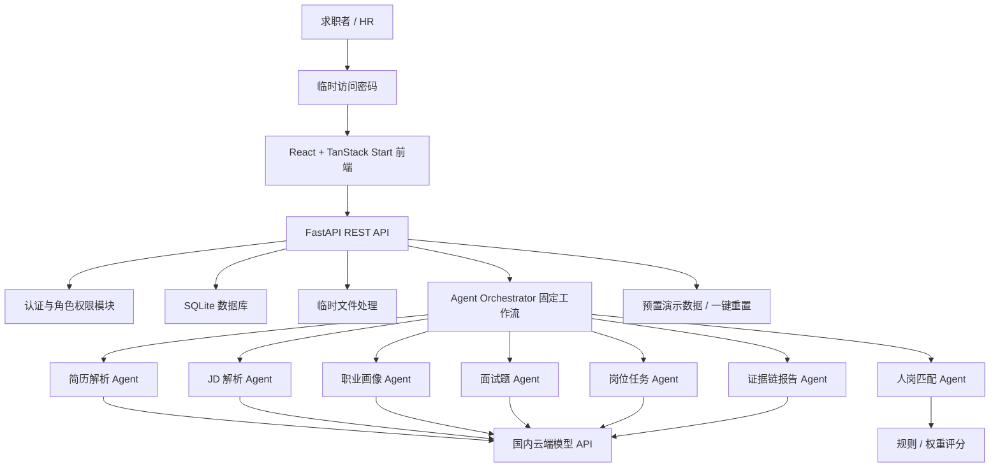

# HireLink 技术架构文档

## 1. 项目背景

HireLink 是一个面向比赛 / 演示 MVP 的 AI 招聘能力验证系统。当前目标不是做完整企业 ATS，也不是做功能堆叠型招聘平台，而是稳定跑通一条清晰闭环：

```text
简历解析 -> 岗位理解 -> 人岗匹配 -> 个性化面试 -> 岗位能力试炼 -> AI 面试证据链报告 -> 求职者成长中心
```

第一版优先覆盖 1-2 类岗位，使用脱敏真实数据和预置演示数据降低现场失败风险。系统要能讲清楚 AI 如何辅助招聘判断，但最终录用、淘汰和是否进入真人面试必须由 HR 作出。

## 2. 架构阅读规则

本文同时记录当前架构和目标架构：

- **Current / As-Is Architecture**：只描述当前代码已经存在的路由、模块、模型、前端调用链和测试证据。
- **Target / To-Be Architecture**：描述 P0/P1/P2 目标设计，不代表当前已经运行。
- **Planned Extensions**：描述后续可扩展方向，只有进入代码并在 [Implementation Status](./implementation-status.md) 有证据后，才能升级为 Current。

当前代码实现状态的唯一事实源是 [Implementation Status](./implementation-status.md)。

## 3. 开发目标

- 在 3-4 周个人开发周期内完成可稳定演示的 MVP。
- 保留现有 React / TanStack Start / Tailwind CSS 前端，不做大规模重写。
- 新增 Python FastAPI 后端，承载业务 API、权限校验、AI 调用和 Agent 工作流。
- 使用 SQLite 起步，支持演示后清空真实数据，并可一键恢复预置演示数据。
- 使用国内稳定云端模型 API，后端通过适配层封装，避免供应商锁定。
- P0 不录制、不上传、不保存面试音视频，降低隐私、合规和存储成本。

## 4. 当前阶段

当前阶段为 MVP / P0 架构落地阶段，优先保证完整业务闭环、稳定演示和低成本交付。

本阶段不追求极端高并发、完整企业权限、复杂监控、长期音视频复查、可信面试或 ATS 集成。P1 / P2 能力只在数据结构和接口边界上保留扩展空间。

### 4.1 Current / As-Is Architecture（当前实现快照）

当前代码实现与目标架构存在阶段差异；以下只记录当前代码事实：

| 领域 | 当前代码事实 |
|---|---|
| 后端基础设施 | FastAPI app factory、统一响应、错误处理、请求 ID、中间件、配置、SQLite/Alembic 已落地。 |
| 认证 | `/api/v1/auth/register`、`/login`、`/logout`、`/me` 已实现，前端 `authService` 已接入。 |
| 核心招聘闭环 | `demo_data` 模块当前承载岗位、简历、申请、候选人、试炼、报告、决策和 ai_runs 的演示 API；多数字段为 mock/demo payload。 |
| 简历/JD/画像/匹配/报告 | 有部分表或 demo API，但未形成真实模型调用、真实文件上传解析、独立画像 API、完整确定性匹配服务和真实报告生成闭环。 |
| 真人面试预约 | `human_interviews` 后端 API、表、服务和测试已较完整；前端页面组存在，但服务层仍主要使用 localStorage/fallback，未接后端 API。 |
| 通知 | 后端 `notifications` API 已实现；前端通知页当前使用 localStorage 服务。 |
| Agent | `ai_runs` 表和展示接口存在；当前运行记录主要来自 mock/demo 操作，不是完整固定 Orchestrator。 |

## 5. 我的系统设计偏好摘要

- 稳定、清晰、容易开发优先。
- 不使用 Kubernetes、复杂微服务和大型分布式架构。
- 前端和后端通过 API 解耦。
- Agent 功能要明显，但采用固定工作流，不采用完全自由决策。
- AI 只辅助判断，不自动作出最终招聘决定。
- 重要 AI 结论要展示评分依据或回答证据。
- 高成本、低核心价值能力可模拟、简化或延后。
- 当前更重视展示效果、稳定性和开发速度，而不是极端高并发。
- 部署在一台轻量云服务器上，使用 Docker 一键部署。
- 公开 HTTPS 链接外加临时访问密码，业务页面仍需要系统登录。
- 每月基础成本目标控制在 100 元以内。

## 6. 专业架构约束翻译

| 架构维度 | 专业表达 | 通俗解释 |
|---|---|---|
| 架构风格 | 模块化单体 | 先用一个后端项目承载多个业务模块，不拆复杂微服务。 |
| 前后端关系 | REST API 解耦 | 前端负责页面，后端负责数据、权限和 AI 调用，双方通过接口协作。 |
| Agent 编排方式 | Target / To-Be：固定 Orchestrator 工作流 | 当前代码只有 mock `ai_runs` 展示记录；真实固定 Orchestrator 尚未落地。 |
| 数据一致性 | 单库事务优先 | 核心数据先写进同一个数据库，减少多系统同步出错。 |
| 实时性要求 | 非强实时 | AI 报告可以等待几十秒，但页面必须显示进度和失败原因。 |
| 可用性要求 | 演示优先兜底 | AI、ASR 或网络失败时，可以切换预置数据继续演示。 |
| 安全权限 | 简化 RBAC | 不同角色能访问什么由后端判断，不能只靠前端隐藏按钮。 |
| 部署方式 | Target / To-Be：Docker 单机部署 | 当前仓库未提供 Docker Compose；本地仍分别启动前端和后端。 |
| 成本约束 | 轻量云服务器 + 按量模型 API | 服务器、存储和模型调用都要克制，优先满足演示。 |
| 可扩展性边界 | 可替换适配层 | 先预留 PostgreSQL、任务队列、对象存储和多模型适配，但 MVP 不先上。 |

## 7. 技术栈决策

| 层级 | MVP 选择 | 平衡级选择 | 选择原因 | 升级条件 |
|---|---|---|---|---|
| 前端 | React / TanStack Start / Tailwind CSS | 保持 React + 更完整状态管理 | 当前项目已采用该栈，重写成本高 | 页面状态和接口交互明显复杂 |
| 后端 | Python FastAPI | FastAPI + 后台任务队列 | 开发快、OpenAPI 友好、适合 AI 工作流 | AI 任务耗时明显影响体验 |
| API | REST API | REST + 局部 SSE / WebSocket | MVP 简单清晰 | 需要实时进度流或动态追问 |
| 数据库 | SQLite | PostgreSQL | 成本低、易部署、易重置 | 进入真实多人试用 |
| 认证 | 单短期 JWT + HttpOnly Cookie + 角色权限 | Access Token + Refresh Token + 审计日志 | 满足演示账号和简化注册，避免 P0 引入续期链路 | 进入持续使用或真实企业试点 |
| 文件存储 | 临时本地文件 + 可选保留原文件 + 结构化文本入库 | 对象存储 + 签名 URL | 默认不保存原文件，用户显式选择后才保留，兼顾隐私与复查需求 | 需要真实多人试用或跨节点文件访问 |
| 大模型 | Target / To-Be：国内稳定云端模型 API | 多模型适配 + 备用模型 | 当前未发现真实 Provider 接入，代码以 mock 为主 | 主模型不稳定或效果不足 |
| ASR | 浏览器 Web Speech API + 手动文字稿 | 云 ASR / Whisper 服务 | 降低后端复杂度和成本 | 需要更稳定转写质量 |
| 虚拟面试官 | P0 不依赖 | P1 云 TTS + 轻量形象；P2 沉浸式交互 | 当前核心是能力验证，不由呈现层承担题目生成或评价 | 需要增强演示沉浸感 |
| Agent | Target / To-Be：手写固定工作流 | LangGraph / 状态机 | 当前未发现完整固定 Orchestrator，已有 `ai_runs` mock 记录基础 | Agent 分支和异常处理明显增多 |
| 部署 | Target / To-Be：单机 Docker | 分离部署 + 监控告警 | 当前仓库未提供 Docker Compose | 真实用户增长 |
| 日志 | 后端结构化日志 + AI 调用记录 | Sentry / 云日志 | 够用且低成本 | 线上错误排查压力增加 |

## 8. Target / To-Be 系统架构图

> 下图是目标架构，不是当前已完整运行的 As-Is 架构。Current / As-Is 以第 4.1 节和 [Implementation Status](./implementation-status.md) 为准。



## 9. 模块设计

### 9.1 前端模块

- 登录与演示入口：临时访问密码、登录、简化注册、演示账号入口。
- 求职者端：简历上传、职业画像、轻量面试、岗位能力试炼提交、求职者成长中心。
- HR 端：岗位发布、JD 解析确认、候选人排序、面试题确认、报告查看、进入真人面试标记。
- 演示数据维护：通过受控重置脚本和预置数据完成，不提供独立后台页面。
- Agent 展示：展示固定工作流节点、输入摘要、输出摘要、状态和 fallback 状态。

### 9.2 后端模块

> Current / As-Is：当前实际业务 API 主要集中在 `auth_users`、`demo_data`、`human_interviews` 和 `notifications`。下列目标模块只有在 [Implementation Status](./implementation-status.md) 中有代码证据时，才能按当前实现描述。

| 模块 | 当前实现状态 |
|---|---|
| `auth_users` | 已实现用户、组织、注册登录退出、当前用户、demo 账号修复。 |
| `demo_data` | 承载当前核心招聘演示 API，写入 jobs、resumes、applications、match_results、trial、reports、decisions 和 ai_runs，数据源主要为 mock。 |
| `human_interviews` | 已实现真人面试预约后端基础闭环，包括邀约、档期、预约、取消、改期、pending confirmation、提醒维护、真人报告、审计和通知。 |
| `notifications` | 已实现通知列表、单条已读、全部已读的后端接口。 |
| `resumes`、`jobs`、`applications_matches`、`trials`、`reports`、`ai_runs` | 主要已有模型，部分由 `demo_data` 服务读写；尚未全部拥有独立 router/service/repository 闭环。 |
| `profiles`、`interviews` | 当前未形成完整后端业务 API，文档中的职业画像和面试会话仍属于目标能力。 |
- 认证权限模块：用户名或邮箱 + 密码登录、简化注册、登录退出、单短期 JWT、HttpOnly Cookie、角色与资源归属校验。
- 用户与角色模块：求职者、HR 两类角色，不建立业务管理员角色；注册页直接选择角色。
- 企业模块：维护企业基础信息和 HR 企业归属，一个企业可关联多个 HR；P0 仍按岗位创建者隔离业务数据。
- 简历 / JD 模块：上传、临时文件处理、文本抽取、结构化结果保存；AI 请求当前同步执行，前端显示加载和失败状态。
- AI 模型适配层：统一封装国内云端模型 API，记录模型名、提示词版本、输入摘要、输出和错误。
- Agent 编排模块：按固定步骤串起解析、画像、匹配、题目、任务和报告生成。
- 报告模块：生成一个结构化报告实体，通过权限过滤提供 HR 版和求职者版两个视图；报告经 HR 确认后才向求职者开放。
- 演示数据模块：导入、清空真实数据、恢复预置数据、标记数据来源。
- 文件处理模块：限制文件大小；默认在解析完成后清理原文件，求职者显式选择保存时转入受控持久目录并记录归属与保留状态。

#### 8.2.1 简历上传与解析落地决策

- 文件范围：P0 只支持可直接提取文本的 PDF 和 DOCX，不支持扫描版 PDF、图片简历和旧版 DOC；不支持的文件需要返回明确原因。
- 结构化字段：固定提取姓名、联系方式、教育经历、项目经历、实习经历、技能和证书。字段允许为空，AI 不得补写原文不存在的信息。
- 解析流程：后端先在本地提取简历全文，再调用模型输出结构化 JSON，最后通过后端 JSON Schema 校验后写入业务数据。
- 文件生命周期：文件大小不超过 10MB，上传后先进入受控临时目录。默认在解析成功、部分成功或失败后删除原文件；只有求职者在上传时显式选择“保存原文件”，且解析记录成功创建后，才将文件转入受控持久目录。
- 原文件访问权限：已保存的简历原文件只能由简历所有者，以及满足“候选人已申请该岗位且岗位 `created_by` 为当前 HR”的岗位创建 HR 通过后端鉴权接口读取。同企业其他 HR、其他求职者和未建立对应申请关系的 HR 均无权访问。
- 错误处理：保留文件级错误说明、重新上传和粘贴文本兜底；同时支持部分解析成功、字段级错误提示、用户人工修正结构化结果，以及基于修正结果重新触发后续生成。
- 数据保存：始终保存文件名、抽取文本、结构化结果、解析状态和必要错误信息；可选保存原始文件的受控存储标识、MIME、大小和保留状态，不建立完整字段修订审计记录。
- 简历版本：上传新简历时新增版本，不覆盖旧版本；每位求职者可保留多份简历，并明确一份当前使用版本，同一求职者在任一时刻只能有一份当前版本。画像、匹配和报告必须关联具体简历版本，不能只关联用户。
- 任务执行：AI 请求当前同步执行，前端显示加载状态；API 和数据库预留 `pending`、`running`、`completed`、`failed`、`fallback` 状态。失败请求可由用户重试，重试沿用同一简历版本，不重复创建业务版本。
- 任务基础设施：P0 不引入 Redis、Celery 或消息队列。对固定测试样本记录耗时；若实际请求经常超过 15 秒或出现超时，再升级为后台任务加前端轮询，并将任务状态持久化在 SQLite。
- 安全基线：同时校验扩展名、MIME 类型和文件大小，使用随机临时文件名，禁止使用用户文件名拼接磁盘路径。

#### 8.2.2 岗位发布与 JD 解析落地决策

- 当前范围：采用纯 MVP 岗位发布与 JD 解析方案。P0 不为岗位增加企业归属字段或画像修订号，不实现企业共享岗位、岗位画像历史版本、字段级来源追踪或完整审计能力。
- 岗位权限：HR 只能查看、编辑、发布、关闭和归档自己创建的岗位，资源授权统一以 `created_by` 为准。P0 不根据企业归属共享岗位，也不允许其他 HR 管理该岗位。
- 岗位输入：HR 至少填写岗位名称、JD 原文、工作地点和岗位类型。JD 原文作为 AI 解析和人工复核的依据保存；岗位画像不能替代 JD 原文。
- 岗位画像结构：固定保存岗位职责、必备技能、加分技能、经验要求、学历要求和风险提示。必备技能与加分技能使用两个结构清晰的列表，不在 P0 为每项技能增加重要度、原文证据或字段来源元数据。
- 画像字段来源：P0 不记录“AI 提取、HR 输入、HR 修改”等字段级来源。系统只保存当前岗位画像、最近一次 AI 原始输出和岗位自身的数据来源标记；演示预置数据仍通过统一的演示数据标记识别。
- AI 解析与人工确认：AI 输出必须经过后端 Schema 校验，然后进入待确认状态。HR 可以修改解析结果，只有点击确认后，该岗位画像才能作为人岗匹配、智能提问和岗位任务生成的正式输入；AI 结果不得未经确认直接进入后续业务流程。
- 状态流转：岗位状态至少包含 `draft`、`parsing`、`pending_confirmation`、`confirmed`、`published`、`closed`、`archived` 和 `failed`。基础流转为 `draft -> parsing -> pending_confirmation -> confirmed -> published`；解析失败进入 `failed`；已发布岗位可进入 `closed`，关闭后的岗位可进入 `archived`。
- 确认后修改：HR 可以修改已确认或已发布岗位的 JD 或岗位画像。发生修改后，画像必须重新进入 `pending_confirmation`，未经再次确认不得用于新的匹配、面试题或岗位任务生成；已产生的旧结果标记为待重新生成，不能静默沿用。
- 画像保存：P0 只保存当前确认的岗位画像和最近一次 AI 原始输出。重新解析、人工修改或再次确认会覆盖当前结果，不保存修订号，也不提供历史画像的查询、恢复或差异对比。
- 匹配参与规则：必备技能、加分技能、经验要求、学历、学校和毕业年份均可作为人岗匹配输入。学历、学校和毕业年份仅在 JD 明确提出对应要求时，作为“经历匹配”维度的结构化子项参与计算；系统不得自行推断学校偏好。未满足相关要求时只扣减对应维度分数并形成待人工确认的缺口，不作为自动淘汰或硬性拒绝条件。具体权重由人岗匹配规则统一定义，LLM 不得自行决定权重或直接裸打分。
- AI 失败处理：JD 解析失败时，HR 可以重试解析、跳过 AI 后人工填写岗位画像，或在演示场景中显式选择预置岗位画像。使用预置结果时必须标记为演示兜底，不能伪装成当前 JD 的真实 AI 解析结果。
- 数据一致性：HR 修改已确认或已发布岗位时，后端直接将该岗位已有的匹配结果、面试题和岗位任务标记为过期。岗位画像再次确认后，系统提示重新生成这些下游结果，避免新旧画像混用。

#### 8.2.3 职业画像落地决策

- 当前范围：采用 MVP 职业画像方案。画像基于已成功解析并由求职者确认的结构化简历生成，不建立全局标准标签库、画像历史对比、指定版本恢复、备用模型或自动质量评分平台。
- 访问权限：求职者只能查看自己的职业画像；HR 只能查看已申请其本人创建岗位的候选人画像。后端必须同时校验候选人申请关系和岗位 `created_by`，不能只依赖前端入口控制。
- 输出结构：职业画像固定包含技能标签、岗位倾向、优势、发展方向 / 待验证项和项目亮点。技能标签由 AI 输出自由字符串，后端负责去除空值、去重，并默认限制为 5-12 个、单个标签不超过 50 个字符；P0 不映射到统一标签字典。
- 证据结构：技能标签、优势、发展方向 / 待验证项和项目亮点中的每项结论至少保存 `source_field` 和 `evidence_text`，分别表示对应的简历结构化字段和支持该结论的简历文本。P0 不保存实体 ID、字符偏移、片段位置或完整字段级审计链。
- 证据约束：画像只能使用当前关联简历版本中的明确内容。简历没有提供的信息必须保持未知或表述为“待验证”，不得补写事实，也不得把缺少证据直接解释为候选人不具备该能力。
- 敏感推断边界：禁止根据姓名、照片、学校、经历或文本推断性别、年龄、民族、婚育、宗教、健康、残障等敏感属性；禁止输出缺乏简历证据的人格、心理、诚信或潜力判断。负向表达统一使用“发展方向”或“待验证项”，避免确定性负面标签。
- Schema 校验：职业画像 Agent 必须输出版本化 JSON，并通过后端 JSON Schema 校验后入库。Schema 至少约束字段类型、数组数量、字符串长度、证据字段和禁止字段；校验失败的输出不得进入匹配流程。
- 画像版本：职业画像版本与简历版本相互独立。每次基于某个 `resume_version_id` 成功生成画像时创建新的画像版本并递增 `profile_version`，不覆盖旧画像；业务默认读取该求职者最新成功的画像版本。P0 不提供历史版本比较、指定版本切换或回滚页面。
- 下游关联：匹配、面试题和报告必须记录实际使用的 `candidate_profile_id` 和 `resume_version_id`。上传新简历或生成新画像不会静默修改已有结果；需要基于新画像重新生成时，由业务流程显式触发。
- AI 失败处理：首次生成失败后最多自动重试 1 次；仍失败时返回可解释错误并提供人工重试。演示场景可以显式使用预置画像兜底，但必须保存 `data_source=demo_fallback`，不能伪装为当前简历的真实生成结果。
- 质量验收：P0 只做确定性检查，包括 JSON Schema 合法、必需字段完整、结论证据覆盖和敏感属性禁区检查。标签准确率、跨模型一致性、人工抽检平台和自动质量阈值属于后续平衡级能力，不进入当前 P0。

#### 8.2.4 人岗匹配落地决策

- 候选关系：P0 只支持求职者主动点击“申请岗位”创建 `application` 关系。只有申请成功后，系统才能为该求职者和岗位生成匹配结果，HR 也只能查看已申请其本人创建岗位的候选人。HR 邀请候选人属于平衡级能力。
- 评分维度：P0 固定使用技能匹配、经历匹配、项目相关度和求职意向 4 个维度，不允许按岗位调整维度或权重。
- 固定权重：总分计算公式为 `技能匹配 30% + 经历匹配 25% + 项目相关度 35% + 求职意向 10%`。每个维度先归一化为 0-100 分，再按固定权重加权求和，最终总分限制在 0-100。
- 维度输入：技能匹配使用必备技能和加分技能命中情况；经历匹配使用相关实习 / 工作经历，以及 JD 明确提出的学历、学校和毕业年份要求；项目相关度使用项目经历与岗位职责、技能要求的结构化标签重合情况；求职意向使用岗位方向、地点和岗位类型的一致性。
- 必备条件：缺少必备技能或未满足 JD 明确要求时只扣减对应维度分数，并在能力缺口或风险点中说明，不自动淘汰候选人，也不产生自动拒绝状态。
- LLM 职责：LLM 只负责从简历和 JD 中提取标准化标签，并基于后端计算结果生成推荐理由、能力缺口和风险解释；LLM 不得修改维度分、权重、总分或候选人排序。
- 规则版本：P0 固定使用 `match_rule_v1`。每条匹配结果必须保存规则版本、四个维度分、总分和用于解释的输入摘要；P0 不提供岗位级权重配置和规则快照编辑。
- 属性边界：学历、学校和毕业年份允许按上述规则参与评分。性别、年龄、出生日期、民族、婚育、宗教、健康、残障、照片和外貌等属性不得进入评分输入、理由或风险解释。禁止从姓名、照片、学校或文本间接推断这些属性。
- 数据与执行：P0 使用 SQLite 保存申请关系、匹配结果和规则版本，不引入向量数据库、机器学习排序模型或独立推荐服务。匹配规则采用可测试的确定性后端代码实现。
- 验收基准：为首批 2 类岗位准备 10-20 个脱敏人工标注样例，验证每个样例都能稳定生成四维分、总分、理由和缺口，并由产品 / HR 人工检查排序是否符合预期。平衡级再扩展到 30-50 个样例并比较人工排序一致率。
- 平衡级边界：平衡级可以增加 HR 邀请来源、语义相似度辅助、岗位级权重配置、规则快照和更完整的证据引用，但不得改变“规则负责评分、LLM 只负责提取和解释、最终决定由 HR 作出”的边界。

#### 8.2.5 智能面试提问落地决策

- 当前选择：采用 MVP 基线，并加入平衡级的 HR 精细调整、题目数量调整、草稿保存、确认版本回退和修改记录能力；不加入题目难度分层、历史题目模板缓存、模型二次内容审核或企业级审计系统。
- 生成前提：仅当岗位画像已确认、候选人已申请该岗位且匹配结果有效时，才能生成面试题。生成记录必须关联实际使用的 `application_id`、`job_id`、`resume_version_id`、`candidate_profile_id` 和 `match_result_id`，不能只关联用户或岗位。
- 题目数量：默认生成 5 道题，HR 可在 5-8 道范围内调整本次生成数量；超出范围的请求由后端拒绝。
- 题目范围：固定覆盖项目经历、岗位技能和能力缺口 3 类，不增加基础、进阶、风险追问等难度分层要求。每道题必须保存题目正文、题目类别、考察能力、提问依据、`source_type` 和 `source_reference`。
- 来源约束：`source_type` 只允许简历字段、岗位要求和匹配缺口。`source_reference` 保存支持该问题的简短字段或条目引用，不保存字符偏移或完整证据审计链。默认 5 道题时至少 4 道具有有效来源；生成 6-8 道时，至少 80% 的题目具有有效来源。
- HR 调整：AI 生成后，HR 可以选择、删除、手动编辑或单题重新生成，调整内容自动保存为当前草稿，并在调整完成后确认整套题目。只有已确认的题目集才能进入候选人面试会话。
- 内容安全：P0 使用后端确定性规则检查并拦截敏感或歧视性问题，不增加第二次模型审核。题目不得询问或推断性别、年龄、出生日期、民族、婚育、宗教、健康、残障、家庭状况等与岗位能力无关的敏感信息；命中规则的题目不得进入 HR 确认列表。
- 草稿与确认版本：每个申请关系保留一份当前可编辑草稿。每次 HR 确认整套题目时，基于当前草稿创建一个不可变的已确认版本，并记录当前生效版本。HR 可以继续从已确认版本创建新草稿，也可以将历史确认版本恢复为当前版本；回退操作不覆盖或删除已有确认版本。
- 修改记录：题目选择、删除、手动编辑、单题重新生成、整套确认和版本回退都必须记录操作者、操作时间、动作类型、目标题目或题目集，以及变更前后摘要。P0 修改记录用于问题追溯和版本解释，不扩展为企业级审批、签名或合规审计系统。
- 生成执行：P0 先使用同步请求，前端显示统一加载状态。API 和数据库预留 `pending`、`running`、`completed`、`failed`、`fallback` 状态；若实际测试中经常超过 15 秒或出现请求超时，再升级为后台任务加前端轮询，不提前引入消息队列。
- 失败兜底：真实生成失败时，HR 可以重试或显式使用与岗位类别对应的预置题目。预置结果必须标记为 `fallback`，不能展示为本次模型真实生成结果。
- 保存边界：业务数据保存当前草稿、历次已确认题目集版本、题目来源、当前生效版本和修改记录；模型调用的必要追踪信息统一保存在 `ai_runs`。P0 不建设题目模板库，也不把同岗历史生成结果作为自动复用缓存。
- P2 动态追问：复用本模块的来源引用、内容安全和会话状态边界；实时通信、触发条件、上下文长度、追问数量及异常降级尚未冻结，不进入 P0 Runtime。

#### 8.2.6 岗位能力试炼落地决策

- 当前选择：采用 MVP 任务内容和最终决策边界，并加入平衡级的任务重新生成、一次重交、截止时间、有限附件、AI 参考评分、完整任务状态和文件安全能力；不保存任务历史版本，也不保存首次提交内容。
- 生成与发布：岗位任务 Agent 基于已确认的岗位画像生成 1 个轻量任务，内容固定包含背景、要求、交付物和评分标准。AI 生成后进入 `draft`，HR 可以修改或重新生成；只有 HR 确认并发布后，候选人才能查看和开始任务。P2 的场景化多步骤模拟复用本模块，不另建独立入口。
- 任务版本边界：任务发布前重新生成或修改时直接覆盖当前草稿，不保存任务历史版本。任务发布后内容保持不变，避免候选人执行期间任务要求发生变化。
- 提交方式：候选人可以提交文本、HTTP / HTTPS 链接或有限附件。链接只保存和展示，后端不得主动抓取、解析或执行链接内容，避免 SSRF、恶意下载和外部代码执行风险。
- 附件范围：只允许 PDF、DOCX、TXT、PNG 和 JPG，单个文件不超过 10MB。后端必须同时校验扩展名、MIME 类型和文件大小，使用随机文件名和受控目录保存，不允许执行文件内容。
- 附件存储：任务附件属于需要供 HR 查看和报告引用的交付物，不采用简历“解析后立即删除”的临时文件策略。P0 使用受控本地目录保存，并在数据库中记录原始文件名、随机存储名、MIME、大小和归属信息；访问附件必须经过后端角色和资源归属校验。
- 提交次数：默认只允许提交一次。HR 可以在截止时间前针对当前申请开放一次重新提交；开放后任务回到 `in_progress`。重新提交会覆盖首次提交内容并删除被覆盖的旧附件，系统只保留最终提交文本、链接和附件，不提供首次提交内容的查询或恢复。为执行次数限制，可以保留提交次数、首次提交时间和最终提交时间等最小元数据，但不得将其展示为完整提交版本历史。
- 截止时间：HR 可以设置任务截止时间。截止后未提交的任务进入 `expired`，后端拒绝新的首次提交和重新提交；P0 不增加截止后延期、重新开放或补交能力。
- 状态流转：任务状态采用 `draft -> published -> in_progress -> submitted -> evaluated`，并允许未按期提交的 `published` 或 `in_progress` 任务进入 `expired`。候选人首次打开并开始任务时进入 `in_progress`；提交后进入 `submitted`；AI 评价成功后进入 `evaluated`；HR 在截止前开放重交后，任务从 `submitted` 或 `evaluated` 回到 `in_progress`。
- AI 评价：提交后，AI 按任务评分标准输出维度参考分、表现评价、证据和能力缺口。所有分数必须明确标记为“AI 参考评分”，并通过后端 Schema 校验；AI 不得把参考分直接转换为淘汰、录用或进入真人面试的最终决定。
- HR 权限：HR 可以查看 AI 参考评分、评价和证据，但 P0 不允许 HR 修改 AI 原始评价或参考分。HR 必须基于任务证据、面试报告和其他业务信息独立作出是否进入真人面试的决定。
- 失败兜底：真实任务生成失败时，HR 可以重试或显式使用与岗位类别对应的预置任务。预置任务必须标记为 `fallback`，不能伪装为本次模型真实生成结果；候选人的真实提交和后续评价仍进入正常主流程。

#### 8.2.7 面试会话与记录落地决策

- 当前选择：摄像头和麦克风采用平衡级设备体验，会话、提交、事件和数据保存采用 MVP 边界；语音回答为主，浏览器在回答过程中实时转写，文字输入作为兜底。
- 设备权限：进入面试前默认申请摄像头和麦克风权限。拒绝摄像头或麦克风授权时不得阻塞面试，页面需要说明受影响能力，并允许降级为仅语音或纯文字回答。
- 设备检测：页面提供摄像头、麦克风和浏览器 ASR 能力检测，并提供重新授权入口。P0 优先支持 Chrome 和 Edge；其他浏览器检测为不支持时直接使用文字回答兜底，不承诺实时转写。
- 摄像头边界：摄像头只用于候选人浏览器内的本地实时预览。媒体流只存在于当前页面生命周期，不录制成文件、不上传后端、不持久化，也不参与 AI 评分或可信面试判断。
- 回答与转写：语音回答为主，使用浏览器 Web Speech API 在回答过程中生成临时文字稿。每题结束后，候选人可以确认或修改文字稿；ASR 不可用或失败时，可以直接输入文字。
- 回答时限：P0 不设置强制倒计时，不因回答时间自动提交或终止，只记录必要的开始、结束和提交时间。
- 草稿保存：每题文字稿通过 REST API 自动保存到后端，刷新或短暂中断后可以恢复。P0 不增加前端本地草稿作为第二存储源，避免本地敏感文字长期残留。
- 会话状态：面试会话至少支持 `created`、`in_progress`、`paused`、`submitted`、`expired` 和 `abandoned`。正常流程为 `created -> in_progress -> submitted`；用户主动暂停进入 `paused` 并可恢复；明确退出并放弃进入 `abandoned`。
- 会话有效期：P0 固定从会话首次由 `created` 进入 `in_progress` 的时间开始计算 24 小时，并保存 `started_at` 和 `expires_at`。暂停、刷新或重新进入不会停止或重置计时；超过 `expires_at` 仍未最终提交的 `in_progress` 或 `paused` 会话进入 `expired`。
- 过期处理：`expired` 会话只允许读取已保存内容，不允许继续逐题保存、恢复作答或最终提交，也不得触发报告生成。候选人仍具备面试资格时，需要重新创建新会话；P0 不支持 HR 配置有效期、延长旧会话或恢复过期会话。
- 提交幂等：逐题保存和最终提交均使用后端状态校验与幂等键，重复请求不得创建重复回答、重复提交记录或重复触发报告生成。
- 事件范围：P0 只持久化面试开始、结束、逐题保存和最终提交等必要事件，以及 `sessionId`、`questionId`、`startTime`、`endTime`、`submitTime`。设备检测、授权失败和重新授权主要用于前端降级提示，不扩展为可信面试风险事件或结论。
- 实时通信：P0 使用普通 REST API 完成会话创建、逐题保存、恢复和最终提交，不引入 WebSocket 或 SSE。
- 敏感数据：后端只保存确认后的回答文字稿、必要会话状态和最小事件元数据，不保存音频、视频、浏览器媒体流或摄像头画面。
- P2 音视频回放：复用面试会话和资源归属，不建立第二套会话入口；授权方式、保存期限、对象存储、访问控制和删除机制尚未冻结，不进入 P0 Runtime。

#### 8.2.8 AI 面试证据链报告落地决策

- 报告实体：每次报告生成只创建一个 `evaluation_report` 实体，不分别调用模型生成 HR 报告和求职者报告。
- 权限视图：同一实体包含公共评分与证据、HR 私有风险与内部结论、求职者可见优势与成长建议。API 根据当前角色返回 HR 版或求职者版，不能依赖前端隐藏字段。
- 状态流转：报告生成成功后进入 `pending_review`，仅岗位创建 HR 可读取完整 HR 版；HR 确认发布后进入 `confirmed`，求职者才可读取求职者版。
- 确认边界：HR 确认只代表允许向求职者发布，不修改 AI 原始报告内容。AI 输出存在问题时应重新生成新结果，不直接覆盖或人工改写原始输出。
- 证据要求：重要评分、风险和建议必须关联回答、岗位任务、匹配结果或画像中的明确证据；求职者版只能返回其有权查看的证据摘要。
- 访问边界：未确认报告对求职者统一返回不可见状态，不通过响应字段暴露 HR 私有内容、内部推荐结论、风险备注或确认前草稿。

#### 8.2.9 多 Agent 协作面板落地决策

- P0 定位：多 Agent 协作面板属于 P0 必做能力，用于展示后端固定 Orchestrator 的真实执行过程，不是静态流程图或前端伪造动画。
- 数据来源：面板只读查询真实 `ai_runs`，展示节点状态、脱敏输入输出摘要、模型版本、Prompt 版本、耗时、错误和兜底来源。
- 节点范围：至少覆盖简历解析、职业画像、JD 解析、人岗匹配、智能提问、岗位任务和报告生成。
- 只读约束：面板不得提供修改 Agent 输出、重排工作流、重试业务任务或改变业务状态的能力；业务重试仍由对应业务模块执行。
- 隔离要求：输入输出摘要必须移除姓名、电话、邮箱等直接身份信息。面板接口仍需校验用户角色和业务资源归属。
- 故障边界：面板接口失败、记录缺失或页面渲染异常只影响流程展示，不得中断或回滚主业务流程。

#### 8.2.10 真人面试预约 P1 概念架构

本节只定义未来边界、职责、概念关系和一致性要求，不修改 P0 公共契约、现有数据库实体或 Runtime，不定义 URL、OpenAPI、数据库表或迁移。进入接口、数据和页面设计前，PRD 中已收敛的 A/B 级规则必须全部冻结。

模块边界：

- 首期在模块化单体中使用 `human_interviews` 逻辑模块，统一承载 Interview Booking、Interview Invitation、Availability Management、Human Interview Session 和真人面试报告编排，避免在规模和规则尚未稳定时拆成多个服务。
- Notification 作为跨模块能力，接收预约确认、待补全、改期、取消、会议/地点/联系方式变更、完成/未到场、报告发布和面试前提醒事件；通知发送失败只记录并允许重试，不回滚预约业务状态。
- Meeting Integration 只保留适配边界。P1 首期不自动创建第三方会议，由岗位创建 HR 或主面试官预先维护会议链接，预约成功后系统发送已维护链接。
- Location Management 采用企业/岗位级地点模板 + 到场说明，不接地图服务；缺会议链接或线下精确地址时不得开放对应时间段。
- `Interviewer` 首期表示关联现有 HR 或企业授权账号的主面试官能力档案，不新增公开注册角色，不引入企业管理员。
- Human Interview Report 与 `evaluation_reports` 保持独立。AI 证据链报告仅保留真人面试报告引用，不直接合并真人内容，也不反向更新 AI 匹配、推荐或能力画像。

C 级未来边界：

- Meeting Integration 未来保留供应商适配层，不提前绑定具体会议供应商；自动创建失败、重试、幂等和通知策略留到实现前设计。
- Calendar Export 作为未来轻量边界，优先支持 `.ics` 最小信息导出；`.ics` 不作为排班事实源，不读取外部忙闲，默认只暴露时间、标题和平台入口，敏感详情经登录查看。
- Location Management 未来仍以企业/岗位地点模板和到场说明为主；地图、路线和签到不纳入当前架构假设。
- Scheduling Extension 可在 `AvailabilitySlot` 上层增加周期性规则模板、例外日和批量关闭；候补、容量、多轮、多面试官不复用 P1 单预约状态机，未来独立建模。
- Interviewer Recommendation 未来只做规则推荐，不自动分配；岗位创建 HR 仍是最终确认主体。
- Recording Boundary 作为企业可配置扩展能力，必须有求职者同意、30 天默认短期留存、访问审计和删除策略；不扩大平台对录制内容真实性或企业使用目的的责任。
- Data Lifecycle 需要区分当前申请内长期保留和授权进入人才库；未授权数据不得跨岗位、跨企业或人才运营复用，删除请求、授权撤回和审计保留需独立处理。
- Export & Audit 未来支持真人报告 PDF 与 CSV/Excel 导出，默认范围为已发布报告和预约摘要；下载和敏感查看写入审计，普通 HR 和面试官不直接查看审计日志。

核心概念对象：

| 概念对象 | 职责与关键关系 | 必要字段方向 |
|---|---|---|
| `InterviewInvitation` | 岗位创建 HR 为具体岗位申请生成的预约资格和受控入口，绑定候选人、申请、主面试官和面试类型 | application、candidate、created_by_hr、primary_interviewer、interview_type、token reference、expires_at、revoked_at、status |
| `InterviewBooking` | 一次企业真人面试预约，关联邀请、岗位申请、求职者、主面试官、类型、当前状态和可能的改期前后记录 | invitation、application、candidate、primary_interviewer、interview_type、scheduled interval、duration、status、replacement relation、created/updated time |
| `AvailabilitySlot` | 主面试官开放的一次性可预约时间段，采用 30 分钟粒度、默认 60 分钟面试和 15 分钟后置缓冲，被有效预约占用或释放 | interviewer、start/end、timezone、availability status、capacity=1、buffer policy |
| `Interviewer` | 企业授权主面试官档案，关联现有账号、企业授权范围和工作联系方式 | user、organization、display information、work contact、authorization status |
| `HumanInterviewSession` | 实际真人面试场次及履约结果；名称用于区分现有 AI `interview_sessions` | booking、actual start/end、completion/candidate_no_show/interviewer_no_show outcome |
| `MeetingInformation` | 人工维护的线上会议加入信息及可见范围 | provider/manual link reference、join information、visibility status、last_editor |
| `InterviewLocationTemplate` | 企业/岗位级线下面试地点模板和到场说明 | organization、job optional、address summary、precise address、arrival instructions、active status |
| `BookingParticipant` | 预约参与者及其角色、通知和可见范围；P1 首期为 1 名候选人 + 1 名主面试官 | booking、user/contact reference、participant role、visibility |
| `BookingStatusHistory` | 记录每次状态变化的前后状态、触发者、时间和原因 | booking、from/to status、actor、reason、occurred_at |
| `HumanInterviewReport` | 真人面试后的轻量结构化独立报告，支持企业内部视图、求职者摘要视图和 AI 报告引用 | session、author_interviewer、reviewer_hr、status、conclusion、ability assessment、observations、risks/followups、candidate summary、internal notes |
| `BookingAuditRecord` | 记录链接生成/撤回、档期变更、预约状态变化、敏感信息查看和报告发布 | actor、action、resource、resource_id、occurred_at、reason/context |

状态流转草案：

- 邀请链接由岗位创建 HR 在上游人岗匹配、AI 面试、岗位能力试炼和已确认 AI 证据链报告全部完成后生成；链接绑定具体申请、候选人、主面试官和线上/线下面试类型，3 天有效且不得超过可预约窗口。
- 链接必须由对应候选人登录后使用；未登录先登录，账号不匹配拒绝。撤回链接只使未预约入口失效，已创建预约必须走预约取消或改期状态机。
- 预约主路径为 `draft -> confirmed`。候选人提交后立即确认并锁定时间段，系统发送站内通知和已维护的会议或地点邀请。
- `pending_confirmation` 仅用于预约后会议链接、地点模板、联系方式等关键履约信息失效或撤回；该状态继续占用时间段，6 小时内未补齐则系统取消预约并释放档期。
- `confirmed` 可以进入 `completed`、`candidate_no_show`、`interviewer_no_show`、`cancelled` 或 `rescheduled`。
- 改期必须将旧预约原子地标记为 `rescheduled`，释放或转移旧时间段，并创建关联的新预约；旧预约不得回退为可编辑状态。
- `cancelled`、`rescheduled`、`completed`、`candidate_no_show`、`interviewer_no_show` 和因待补全超时产生的终态不得任意回退。
- `expired` 只用于草稿、过期链接或待补全超时，不用于已确认预约的面试结果判断。
- 主面试官或岗位创建 HR 手动标记完成、候选人未到场或面试官未到场；系统不得仅按时间自动推断履约结果。
- 岗位申请轻量阶段与预约联动为 `interview_invited -> interview_scheduled -> interview_completed / candidate_no_show / interviewer_no_show`，不扩展为完整 ATS 状态机，不自动作出录用或淘汰决定。

未来系统交互职责：生成/撤回绑定申请预约链接、校验预约链接和登录候选人、查询指定主面试官可预约日期、查询指定日期时间段、创建预约并锁定时间段、查询我的预约、取消预约、修改预约时间、管理一次性可用时间、维护人工会议链接、维护线下地点模板、获取会议或地点信息、完成面试并提交真人面试报告、HR 确认发布报告、在 AI 证据链报告中展示真人报告引用。本阶段不定义 URL、请求响应结构或 OpenAPI。

一致性与冲突约束：

- 同一求职者和同一岗位申请首期只能存在一个有效预约；同一求职者和同一主面试官在有效预约时间内都不能重叠，线上线下使用同一冲突规则。
- 创建预约时必须完成冲突校验和时间段锁定；重复提交、取消、改期和服务重试必须具备幂等语义，不得生成重复预约或重复释放名额。
- 可预约窗口为提前 14 天开放，面试开始前 24 小时停止预约；时间段粒度为 30 分钟，默认面试 60 分钟并在面试后预留 15 分钟缓冲。
- 求职者最晚可在面试开始前 24 小时取消；企业 24 小时内取消必须填写原因并标记企业临时取消。求职者和企业各最多主动改期 1 次。
- 企业取消、企业改期、双方未到场必须填写原因；求职者按规则提前取消原因选填。
- 上游岗位画像、报告或试炼结果更新后，未预约资格失效；已确认预约不自动取消，但标记为需要 HR 复核。
- 应用内部继续使用带时区 UTC 时间，接口输出遵循现有时间格式；日历和通知按企业/岗位所在地时区展示并明确标注。
- 会议链接、地点模板或联系方式在预约后失效时进入 `pending_confirmation`；通知失败不改变预约状态，只记录失败、允许重试，并可在预约详情提示关键通知可能未送达。

隐私、权限与审计：

- 求职者只能使用绑定本人申请且未过期的预约链接，只能查看自己的预约和求职者可见报告摘要。
- 岗位创建 HR 可以生成/撤回预约链接、授予/撤回预约资格、确认发布真人报告，并在授权范围内取消或改期。
- 主面试官只能查看被授权参与的预约、完整 HR 版 AI 证据链报告、会议/地点和候选人预约联系方式；访问完整 HR 报告必须审计。
- P1 首期不引入企业管理员，也不提供平台管理员介入修改或取消预约的能力；平台只保留审计和必要运维排障边界。
- 会议链接和线下精确地址只在预约 `confirmed` 后向必要参与者展示；候选人在预约时确认本次联系方式，企业侧展示工作联系方式，不默认暴露简历解析出的联系方式。
- 链接生成/撤回、档期变更、预约创建/取消/改期、敏感信息查看、会议/地点/联系方式变更、状态变更和报告发布全部需要 `BookingAuditRecord`。
- 个人信息遵循最小化展示原则；会议链接不得公开暴露，外部适配日志不得保存完整链接或联系信息。

### 8.3 数据模块

| 实体 | 作用 |
|---|---|
| organizations | 企业基础信息；一个企业可关联多个 HR |
| users | 用户名、邮箱、密码哈希、角色、演示账号标记、企业归属 |
| resumes | 简历版本、文件名、抽取文本、结构化解析结果、当前版本标记、解析状态、错误信息、原文件保留选择及可选受控存储元数据 |
| jobs | 岗位信息、JD 原文、创建者、当前岗位画像、最近一次 AI 原始输出、状态和演示数据标记 |
| applications | 求职者、岗位、申请时间和申请状态；作为 HR 访问候选人画像及后续匹配流程的授权关系 |
| candidate_profiles | 职业画像版本、关联简历版本、技能标签、岗位倾向、优势、发展方向 / 待验证项、项目亮点、字段级证据和数据来源 |
| match_results | 规则版本、技能 / 经历 / 项目 / 求职意向维度分、总匹配分、推荐理由、能力缺口、风险点和输入摘要 |
| interview_questions | 当前草稿和历次确认版本中的题目、题目类别、考察能力、提问依据、来源类型、来源引用和兜底状态 |
| interview_question_sets | 题目集草稿状态、确认版本号、当前生效版本、关联申请与上下文版本 |
| interview_question_changes | 题目选择、删除、编辑、单题重生成、确认和回退的操作者、时间、动作类型及变更前后摘要 |
| interview_sessions | 面试会话、`created / in_progress / paused / submitted / expired / abandoned` 状态、`started_at`、`expires_at`、结束时间、提交时间和必要事件 |
| interview_answers | 逐题临时转写稿、候选人确认后的回答文字稿、ASR 状态、手动修正文稿、自动保存时间和幂等键 |
| trial_tasks | 当前岗位任务草稿、背景、要求、交付物、评分标准、截止时间、状态、兜底标记和创建者；P0 不保存历史任务版本 |
| trial_submissions | 最终提交文本、链接、附件元数据、提交次数、首次 / 最终提交时间、AI 参考评分、评价证据和状态；重交时覆盖首次提交内容 |
| evaluation_reports | 单一报告实体、`pending_review / confirmed` 状态、HR 私有内容、求职者可见内容、评分、证据、建议、确认人和确认时间 |
| ai_runs | Orchestrator 运行与 Agent 节点、状态、模型信息、Prompt 版本、脱敏输入输出摘要、耗时、错误和兜底来源 |
| demo_snapshots | 预置演示数据版本、重置时间、数据来源 |

### 8.4 Agent 模块

- 简历解析 Agent：把简历文本转成结构化字段。
- JD 解析 Agent：把岗位描述转成岗位画像。
- 职业画像 Agent：基于简历解析结果生成候选人画像。
- 人岗匹配 Agent：调用规则 / 权重模型生成分数，再由 LLM 解释理由。
- 面试题 Agent：按简历、岗位和能力缺口生成个性化问题。
- 岗位任务 Agent：生成轻量岗位任务和评分标准。
- 证据链报告 Agent：汇总回答、任务、匹配和画像证据，生成结构化报告。

所有 Agent 必须只接收明确输入、输出结构化 JSON，并经过后端格式校验后入库。

## 9. 核心数据流

```text
1. HR 创建岗位
2. JD 解析 Agent 生成岗位画像
3. HR 确认岗位画像
4. 求职者上传简历
5. 后端临时保存文件并抽取文本
6. 简历解析 Agent 生成结构化简历
7. 职业画像 Agent 生成候选人画像
8. 求职者申请已发布岗位，系统建立岗位申请关系
9. 人岗匹配模块计算匹配分并生成解释
10. 面试题 Agent 生成题目
11. HR 确认或调整面试题
12. 岗位任务 Agent 生成试炼任务
13. 候选人完成轻量面试和任务提交
14. 浏览器 ASR 或手动文字稿生成回答文本
15. 证据链报告 Agent 生成报告
16. HR 查看报告并作出真人面试决策
17. 求职者查看反馈和成长建议
```

## 10. Agent 约束

- 采用“固定工作流 + 多个职责清晰的 Agent”，不采用完全自由决策 Agent。
- 关键节点需要人工确认：JD 画像、面试题、最终报告发布和 HR 决策。
- Agent 不允许绕过后端权限，也不允许自由修改关键业务状态。
- Agent 输出必须使用 JSON Schema 或等价结构校验。
- AI 失败时返回可解释错误，并允许使用预置结果继续演示。
- 匹配分不能由 LLM 裸打分，必须由规则或权重模型主导。
- AI 报告里的重要结论必须尽量绑定证据来源。
- 职业画像 Agent 只能基于关联简历版本中的明确证据生成结论，不得推断敏感属性或无证据的人格、心理、诚信和潜力。

## 11. 数据和隐私要求

- 简历、回答文字稿、报告、音视频元数据都属于敏感数据。
- 后端必须校验接口权限，不能只依赖前端隐藏页面。
- 求职者不能访问 HR 内部风险备注、决策备注或其他候选人数据。
- HR 只能访问授权岗位下的候选人、文字稿、报告和已选择保留的简历原文件。简历原文件的 HR 授权必须同时校验申请关系和岗位 `created_by`，不能仅根据企业归属授权。
- 测试数据和演示数据可通过受控维护脚本清理，但不提供独立后台页面。
- 简历原文件默认只临时保存并抽取文本；求职者显式选择保存时，原文件才进入受控持久目录。
- 上传新简历时保留历史结构化版本；每个版本独立记录是否保留原文件，画像、匹配和报告应记录所使用的简历版本。
- 职业画像独立保存版本并关联具体简历版本；求职者只能查看自己的画像，HR 只能查看已申请其本人创建岗位的候选人画像。
- 轻量面试的摄像头仅用于浏览器本地实时预览；P0 不录制、不上传、不保存音频或视频，只保存确认后的文字稿、必要会话状态和最小事件元数据。
- AI 调用要记录模型来源、提示词版本、输入摘要、生成时间和错误信息，便于追溯。
- `ai_runs` 中的输入输出摘要必须脱敏，不保存完整原始 Prompt 或直接身份信息；多 Agent 面板只能读取这些脱敏摘要。
- 演示后真实数据可清空，预置数据可一键恢复。

## 12. 安全要求

- 业务页面仍要求系统登录，不能用临时访问密码替代用户权限。
- 反向代理使用统一临时访问密码保护公开入口；该密码与系统用户账号相互独立。
- 仅支持求职者、HR 两类业务角色，不建立业务管理员角色。
- 注册页直接选择求职者或 HR；使用用户名或邮箱 + 密码登录，不接入短信、邮箱验证码。
- 允许注册者直接选择 HR 是比赛 MVP 的简化方案，不代表真实企业身份认证；进入公开试用前必须升级为邀请码、企业审核或管理员分配。
- 固定提供求职者、HR 演示账号各 1 个，兼顾演示效率和 roadmap 登录验收。
- 密码至少 8 位，使用 Argon2id 哈希存储，不得保存明文密码。
- MVP 只签发单个短期 JWT，不使用 Refresh Token；JWT 过期后必须重新登录。
- JWT 通过 HttpOnly Cookie 保存；生产环境同时启用 Secure，并设置合适的 SameSite 策略。
- 退出登录时由服务端清除 JWT Cookie。
- 登录接口按单 IP 和单账号实施简单限流，降低暴力尝试和演示环境滥用风险。
- 求职者只能访问自己的简历、画像、面试回答、任务提交和反馈。
- 一个企业可关联多个 HR，但 P0 阶段 HR 只能访问自己创建岗位及其关联数据，不共享同企业其他 HR 的岗位数据。
- 所有资源权限由后端同时校验角色和资源归属，不能只依赖前端隐藏页面或按钮。
- JWT 密钥、模型 API Key、临时访问密码必须放在环境变量中。
- 文件上传只接受可提取文本的 PDF 和 DOCX，且不超过 10MB；必须同时校验扩展名、MIME 类型和文件大小。
- 扫描版 PDF、图片简历和旧版 DOC 不进入 P0 解析范围，后端应返回明确的不支持原因。
- 临时文件和可选保留文件都必须使用随机文件名和受控目录，不允许使用用户文件名直接拼接存储路径；保留文件只能通过后端鉴权接口访问。下载接口必须校验请求者是简历所有者，或是该求职者已申请岗位的创建 HR。
- 岗位任务附件只接受 PDF、DOCX、TXT、PNG 和 JPG，单个文件不超过 10MB；必须校验扩展名、MIME 和大小，并通过受控下载接口执行资源归属校验。后端不得执行附件内容，也不得主动访问候选人提交的外部链接。
- AI 输出进入业务表前必须校验结构，避免脏数据污染主流程。
- 删除和重置演示数据属于高风险操作，只允许受控维护脚本或部署环境执行。

## 13. 部署要求

- 使用一台轻量云服务器，Docker 单机部署。
- 推荐容器组成：前端应用、FastAPI 后端、SQLite 数据卷、反向代理 / HTTPS 入口。
- 必须提供固定公开 HTTPS 链接，优先保证比赛评委访问稳定。
- 模型 API Key、JWT Secret、临时访问密码、数据库路径通过环境变量配置。
- SQLite 数据库文件必须挂载到持久化目录，便于备份、导出和重置。
- 支持一键恢复预置演示数据，避免比赛现场 AI、ASR 或网络失败导致断链。
- 不要求大规模监控告警，MVP 保留后端结构化日志和前端可解释错误提示。

## 14. 成本限制

- 月基础成本目标控制在 100 元以内。
- 轻量云服务器优先，避免 GPU 服务器和本地大模型部署。
- 大模型使用国内稳定云端模型 API，控制 prompt 长度、缓存必要结果、保留预置兜底。
- 默认不长期保存视频，避免对象存储、带宽和合规成本。
- 平衡级再考虑对象存储、云 PostgreSQL、云 ASR、日志监控和备用模型。

## 15. MVP 边界

### 15.1 Target / To-Be 必须真实实现

- 登录、退出、简化注册、演示账号和基础角色权限。
- 简历上传、文本抽取和结构化解析。
- 岗位发布和 JD 解析。
- 职业画像生成。
- 人岗匹配排序，且匹配分由规则或权重主导。
- 智能面试提问的预生成题目。
- 岗位能力试炼和任务提交。
- 面试会话与记录的 P0 文字流程和基础事件。
- ASR 或手动文字稿流程。
- AI 面试证据链报告。
- 智能招聘工作台和求职者成长中心。
- 多 Agent 协作面板。
- 演示预置数据和一键重置。

### 15.2 允许简化或兜底

- ASR 可用浏览器 Web Speech API，失败时允许手动输入或备用文字稿。
- AI 失败时允许切换预置画像、题目、任务或报告。
- 受控维护脚本只做演示数据维护和测试数据删除。
- 报告必须提供 HR 版和求职者版两个权限视图，但底层只保存一个报告实体；不做两次独立 AI 生成和完整企业审计。
- 报告生成后状态为 `pending_review`，HR 可查看完整 HR 版并执行确认；确认后状态为 `confirmed`，求职者版才可读取。确认操作不允许修改 AI 原始内容。
- 多 Agent 协作面板是 P0 必做的只读能力；面板故障、查询超时或展示异常不得回写业务状态，也不得阻塞主业务闭环。

### 15.3 不进入 MVP 主实现

- 虚拟面试官。
- 智能面试提问的动态追问。
- 面试会话与记录的音视频回放。
- 可信面试。
- 企业人才运营。
- AI 内推网络。
- 企业 ATS 对接。
- 大规模监控告警。
- 自研模型训练。

## 16. 架构决策优先级

### 16.1 不可违反的硬约束

- 不上 Kubernetes。
- 不拆复杂微服务。
- AI 不自动作出录用或淘汰决定。
- 敏感数据必须后端鉴权。
- 演示必须有预置数据兜底。
- Agent 不能绕过后端权限和状态流转。

### 16.2 应尽量遵守的偏好

- FastAPI 模块化单体。
- SQLite 起步。
- 国内稳定模型 API。
- Docker 单机部署。
- AI 输出结构化校验。
- 重要 AI 结论绑定证据。
- 原文件和视频少存。

### 16.3 可以后续调整的选择

- SQLite 升级为 PostgreSQL。
- 同步等待升级为后台任务队列。
- 临时文件升级为对象存储。
- 单模型 API 升级为多模型适配。
- 手写 Orchestrator 升级为 LangGraph 或状态机。
- 按创建者隔离的简化 RBAC 升级为企业内共享权限、成员管理和审计日志。

### 16.4 当前信息不足的事项

- 具体云服务器厂商。
- 具体模型供应商和调用价格。
- 域名、HTTPS 证书和备案要求。
- 每次演示预计候选人数和并发人数。
- 是否需要给评委长期访问链接。

## 17. MVP 与平衡级升级边界

| 决策项 | MVP 选择 | 平衡级选择 | 选择原因 | 升级条件 |
|---|---|---|---|---|
| 部署 | 单机 Docker | 分离部署 + 监控 | MVP 更稳更快 | 真实用户增长 |
| 数据库 | SQLite | PostgreSQL | 成本低，易重置 | 多人真实试用 |
| AI | 国内模型 API | 多模型适配 + 备用模型 | 稳定、低开发成本 | 主模型不稳定 |
| Agent | 手写固定工作流 | LangGraph / 状态机 | 可控、易解释 | 分支明显增多 |
| 文件 | 默认临时处理，用户显式选择后受控保留原文件 | 对象存储 + 签名 URL | 兼顾隐私、复查和比赛演示 | 真实多人试用或跨节点访问 |
| 视频 | 不长期保存 | 短期音视频存储 | 避免高成本合规 | 需要视频回放 |
| 权限 | 演示账号 + 按创建者隔离的简化 RBAC | 企业内共享权限 + 成员管理 + 审计日志 | 满足演示和基本验收 | 企业试点 |
| 报告 | 单一实体 + HR/求职者双权限视图 + HR 确认发布 | 更低成本地保证双端口径一致和信息隔离 | P0 固定方案 |
| ASR | Web Speech API + 手动文字稿 | 云 ASR / Whisper | 成本低，兜底清晰 | 转写质量成为核心风险 |
| 任务执行 | AI 请求同步等待 + 状态预留 | 后台任务 + 前端轮询 | 控制 P0 复杂度，同时为超时升级保留接口 | 固定测试样本经常超过 15 秒或出现请求超时 |

## 18. 冲突检查

| 冲突 | 冲突原因 | 可以牺牲什么 | 推荐取舍 | MVP 临时方案 |
|---|---|---|---|---|
| roadmap 要注册登录，但演示更偏向快速账号 | 完整账号体系会增加开发和安全工作 | 牺牲企业级注册审核和复杂权限 | 演示账号 + 简化注册 | 两类角色可登录，注册只做基础字段 |
| 注册者可直接选择 HR 角色与真实企业身份认证冲突 | 公开注册无法证明用户确实属于某企业 | 牺牲企业身份真实性和审批流程 | 仅作为比赛 MVP 简化方案 | 公开入口受统一临时密码保护；真实试用前改为邀请码或企业审核 |
| 本地模型与轻量服务器、100 元预算冲突 | 本地模型通常需要更高 CPU/GPU 和调优成本 | 牺牲本地模型展示噱头 | 使用国内云端模型 API | 后端保留模型适配层 |
| 临时访问密码与系统登录重复 | 两层入口都会要求用户输入凭据 | 牺牲一步直达体验 | 临时密码保护公开链接，系统登录保护业务数据 | 演示账号降低登录成本 |
| 演示后清空与兜底数据冲突 | 清空全部数据会破坏现场演示兜底 | 牺牲“全量清空” | 清空真实数据，保留可恢复预置数据 | 受控维护脚本提供一键重置 |
| 证据链可信度与开发速度冲突 | 证据展开需要更细的数据结构和 UI | 牺牲部分华丽展示 | 优先做报告证据展开 | 先展示关键证据片段和来源 |

## 19. 架构设计原则

1. 优先跑通完整业务闭环。
2. 优先稳定演示，不追求极端高并发。
3. 核心业务数据由后端统一管理。
4. AI 输出必须结构化并校验。
5. 匹配分由规则或权重主导，LLM 只负责解释。
6. 重要 AI 结论必须绑定证据。
7. 最终招聘决定必须由 HR 作出。
8. 敏感数据默认少存、限权、可删除。
9. 高成本能力先封装接口，不直接重投入。
10. 预置数据是演示安全网，不替代真实主流程。
11. 后续扩展要可替换，不提前引入重架构。
12. 任何 Agent 都不能绕过后端权限和状态流转。

## 20. 禁止采用的过度设计

- Kubernetes。
- 大规模微服务。
- 自研模型训练。
- GPU 服务器承载本地大模型。
- 完整企业 ATS 集成。
- 长期完整视频保存。
- 可信面试的可见风险提示、高级检测和强判定。
- 大规模监控、告警和风控系统。
- 复杂企业组织架构、审批流和审计体系。
- 在 P0 引入向量数据库作为核心依赖。

## 21. Planned Extensions / 需要保留的后续扩展能力

- SQLite 可迁移到 PostgreSQL。
- AI 请求当前同步执行并预留状态字段；若固定测试样本经常超过 15 秒或出现超时，再迁移到后台任务、前端轮询和独立任务队列。
- 本地临时文件可迁移到对象存储和签名 URL。
- 单一模型 API 可扩展为多模型适配和备用模型。
- 手写 Orchestrator 可升级为 LangGraph 或状态机。
- 智能招聘工作台可扩展筛选、备注、统计、Copilot、候选人横向对比和校招批量处理。
- 报告可扩展 HR 版、求职者版、证据展开和模型版本追溯。
- 面试会话与记录可扩展短期音视频保存和回放；虚拟面试官保持独立呈现能力。
- 智能面试提问可扩展动态追问，复用题目安全、来源引用和会话状态。
- 求职者成长中心可扩展学习主题、回答复盘、练习任务和资源路径，复用已确认报告和能力缺口。
- P1 可增加真人面试预约，在模块化单体内先合并预约链接、预约记录、可用时间和真人场次职责，并为站内通知、人工会议链接、地点模板和真人面试报告保留适配边界；不得与现有 AI 面试会话实体混用。
- 企业人才运营可扩展授权候选人资产、检索和聚合洞察；AI 内推网络在其外部负责经授权关系连接与内推路径推荐，两者保持独立职责。
- 后续可扩展运维脚本、审计日志、数据导出和企业级权限。

## 22. P0 功能架构映射

| P0 功能 | 前端入口 | 后端 / API 职责 | Agent / AI 职责 | 核心数据实体 |
|---|---|---|---|---|
| 登录和基础角色权限 | 登录页、注册页、角色首页 | 认证、JWT、角色与资源归属校验、企业关联、演示账号 | 无 | organizations、users |
| 简历上传与解析 | 求职者简历上传页 | 多版本上传、文本抽取、同步解析状态、字段修正、失败重试、结构化结果保存 | 简历解析 Agent 输出经 Schema 校验的结构化简历 | resumes、ai_runs |
| 岗位发布与 JD 解析 | HR 岗位发布页 | 岗位 CRUD、JD 原文保存、岗位画像保存 | JD 解析 Agent 输出技能、职责、要求、风险项 | jobs、ai_runs |
| 职业画像 | 求职者画像页、候选人详情页 | 画像生成触发、画像结果读取、岗位申请关系鉴权 | 职业画像 Agent 输出技能标签、岗位倾向、优势、发展方向 / 待验证项和证据 | applications、candidate_profiles、resumes、ai_runs |
| 人岗匹配 | HR 候选人排序列表 | 匹配任务触发、分数计算、排序查询 | LLM 负责解释，规则或权重模型负责评分 | match_results、candidate_profiles、jobs、ai_runs |
| 智能面试提问 | HR 题目确认页、候选人面试页 | P0 负责同步生成、5-8 题数量校验、题目安全过滤、草稿保存、HR 编辑与单题替换、确认版本保存和回退、修改记录、失败兜底；P2 动态追问复用本模块 | 面试题 Agent 按简历、岗位和匹配缺口生成带来源的结构化题目；后续按回答生成追问 | interview_question_sets、interview_questions、interview_question_changes、applications、match_results、ai_runs |
| 岗位能力试炼 | 候选人任务页、HR 任务确认与结果页 | P0 负责草稿覆盖式重新生成、HR 确认发布、截止时间、文本 / 链接 / 附件提交、一次重交授权、最终提交覆盖保存、状态流转、附件鉴权和失败兜底；P2 多步骤模拟复用该模块 | 岗位任务 Agent 生成任务说明和评分标准，并按标准输出带证据的 AI 参考评分与评价；不作最终招聘决定 | trial_tasks、trial_submissions、ai_runs |
| 面试会话与记录 | 候选人面试页、文字稿确认区 | P0 负责设备检测与降级、会话状态、逐题 REST 自动保存、恢复、幂等提交、实时转写、答后确认和最小事件记录；P2 扩展授权音视频保存与回放 | 浏览器 Web Speech API 实时转写，文字输入兜底；后续评价消费确认文字稿 | interview_sessions、interview_answers |
| AI 面试证据链报告 | HR 报告页、求职者成长页 | 生成一个报告实体；HR 读取完整视图并确认，求职者仅在确认后读取脱敏成长反馈视图 | 证据链报告 Agent 汇总证据并输出结构化报告 | evaluation_reports、interview_answers、trial_submissions、ai_runs |
| 智能招聘工作台 | 招聘工作台 | P0 负责岗位列表、候选人排序、报告入口和决策标记；P1 扩展智能摘要、追问建议、同岗对比和批量初筛 | Copilot 后续消费匹配和报告结果生成辅助建议，不作最终决定 | jobs、match_results、evaluation_reports |
| 求职者成长中心 | 求职者成长页 | P0 负责反馈读取和敏感信息隔离；P1 在同一入口扩展学习主题、回答复盘、练习任务和资源路径 | 报告 Agent 输出成长建议，后续成长能力消费已确认的回答证据和能力缺口 | evaluation_reports、candidate_profiles |
| 多 Agent 协作面板 | Agent 流程展示页 | 只读查询真实 `ai_runs`，展示节点状态、脱敏输入输出摘要、模型与 Prompt 版本、耗时、错误和兜底来源；故障不阻塞主流程 | 展示后端固定 Orchestrator 的真实执行记录，不修改业务状态 | ai_runs |
| 演示预置数据 | 演示入口、受控重置入口 | 导入、重置、切换预置结果、标记来源 | AI 失败时使用预置输出继续流程 | demo_snapshots、业务表 |

## 23. 验收方式

- 文档验收：本文件覆盖项目背景、开发目标、当前阶段、架构偏好、技术限制、成本限制、安全要求、Agent 约束、数据和隐私要求、部署要求、MVP 边界、禁止过度设计、后续扩展能力。
- 一致性验收：与 `docs/roadmap.md` 的 P0 规格保持一致；对“演示账号 + 简化注册”等取舍明确写出原因。
- 可实施性验收：工程师可按本文件直接搭建 FastAPI + SQLite + 国内模型 API + Docker 的 MVP 后端。
- 风险验收：所有高成本、高复杂度能力都有 MVP 临时方案和升级条件。
